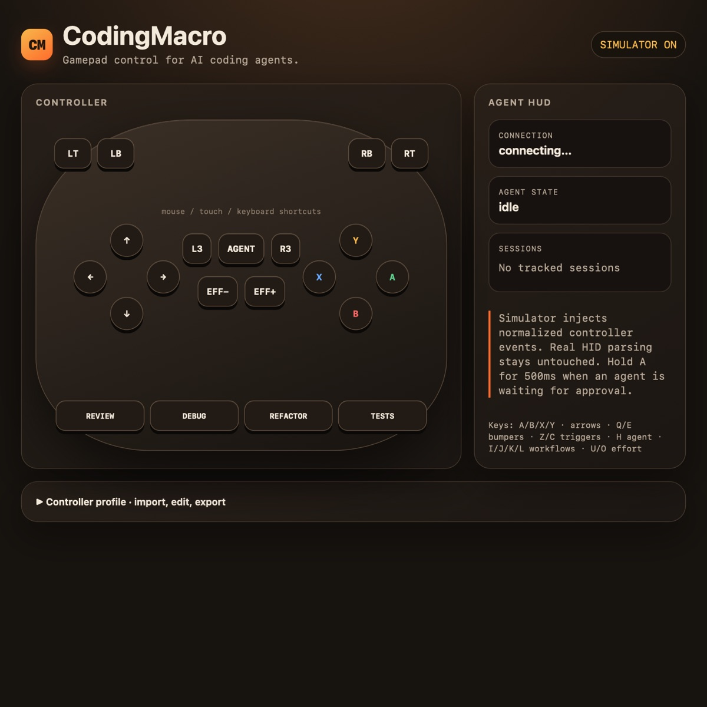

<div align="center">

# CodingMacro

**Gamepad control for AI coding agents.**

Control Codex, Claude Code, and multiple agent sessions from GameSir, Xbox, DualSense, or any compatible controller.

[中文](README.zh.md) · [Controllers](CONTROLLERS.md) · [Contributing](CONTRIBUTING.md)

[](https://github.com/MisterBrookT/CodingMacro)
[](package.json)
[](LICENSE)

</div>



CodingMacro adds agent awareness to ordinary gamepads: lifecycle hooks track execution and approval states, one controller switches across sessions, and a local HUD shows what every button will do. No controller nearby? Browser simulation exercises the same normalized event pipeline.

## Install

One command installs the latest GitHub release:

```sh
curl -fsSL https://github.com/MisterBrookT/CodingMacro/raw/refs/heads/main/install.sh | sh
```

Requires macOS and Node.js 22+. Codex desktop control needs Accessibility permission for keyboard injection. CLI harnesses keep normal terminal keyboard input.

## Start

```sh
codingmacro claude
codingmacro codex
codingmacro codex-app
```

Open live HUD while using a real controller:

```sh
codingmacro --dashboard codex-app
```

Develop or demo without hardware:

```sh
codingmacro --simulate codex-app
```

Simulation is localhost-only and disabled by default. It never creates a virtual OS controller; it injects normalized controller events directly into CodingMacro, matching the application layer used by real HID drivers.

## Controls

| Control              | Default action                  |
| -------------------- | ------------------------------- |
| A / Cross            | Submit; hold 500ms for approval |
| B / Circle           | Interrupt or dismiss            |
| X / Square           | New chat                        |
| Y / Triangle         | Push-to-talk where supported    |
| D-pad                | Navigate agent UI               |
| Left stick flick     | Review, debug, refactor, tests  |
| Right stick rotation | Change thinking depth           |
| Home / Touchpad      | Next agent session              |
| L1 + face/D-pad      | Select one of six layers        |

Edit `~/.codingmacro/config.json` to remap buttons, colors, workflows, and raw key sequences. Invalid configuration fails safely without overwriting the file.

## Agent support

| Capability                 | Claude Code | Codex CLI                | Codex app                      |
| -------------------------- | ----------- | ------------------------ | ------------------------------ |
| Submit / reject / new chat | Yes         | Yes                      | Yes                            |
| Workflow prompts           | Yes         | Yes                      | Yes                            |
| Agent lifecycle state      | Yes         | Yes                      | Yes                            |
| Multi-session routing      | Yes         | Yes                      | App task switching is evolving |
| Push-to-talk               | Yes         | No verified binding      | Yes                            |
| Thinking-depth dial        | Yes         | No deterministic binding | No deterministic binding       |

Unsupported actions stay unmapped. CodingMacro does not guess unstable shortcuts.

## Controllers

Certified fixtures currently cover GameSir Cyclone 2 in DS4 mode, GameSir G7 Pro, Xbox One S wired/Bluetooth, and DualSense. Unknown HID gamepads use a best-effort parser.

```sh
codingmacro doctor
codingmacro doctor --capture
```

Doctor writes a replayable report. See [CONTROLLERS.md](CONTROLLERS.md) to add a model.

## Architecture and trust

- First process binds `127.0.0.1:48762`, owns HID, and aggregates session state.
- Later processes register as clients and receive focused keystrokes over local SSE.
- Claude Code and Codex lifecycle hooks are merged into existing config files atomically.
- Dashboard status is read-only; input endpoint returns `403` unless host started with `--simulate`.
- No telemetry or remote service.

## Build

```sh
git clone https://github.com/MisterBrookT/CodingMacro.git
cd CodingMacro
npm ci
npm run verify
npm run build
npm link
```

## Attribution

Based on [OpenMicro](https://github.com/stephenleo/OpenMicro) by Stephen Leo. Original and new work are MIT licensed; see [NOTICE.md](NOTICE.md) and [LICENSE](LICENSE).
